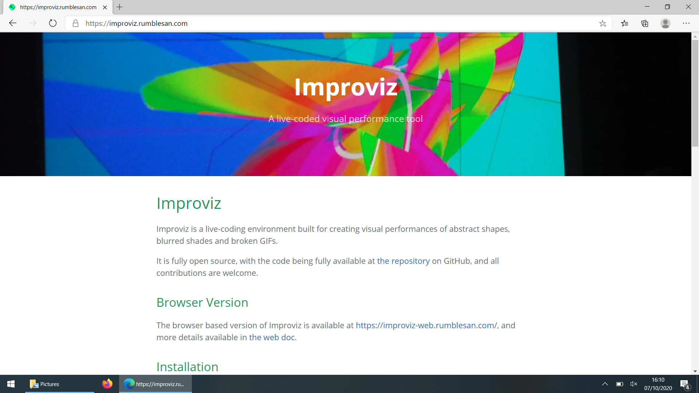

# improviz-windows-guide

Improviz is a live coding environment built by Guy John aka Rumblesan. It is available as a stand-alone desktop application and as a web app. It is similar in appearance and functionality to LiveCodeLab but the desktop version extends this functionality by giving the user the option to load their own custom textures, animated gifs, shaders, and 3D models.

As with a lot of live coding languages, one of the most difficult barriers to using them is setting up the environment and installing them, especially if you're used to just downloading a file and double-clicking it to install and run it.

In this short tutorial I'll show you how to launch Improviz using the terminal, which will be useful when using Improviz but will also put you in a better position for doing programming and using other live coding tools.

For this particular tutorial I’m using a  Windows 10 computer, and will be using the default Microsoft Edge Browser.

Launch your browser and go to https://improviz.rumblesan.com/ . This is the official website for Improviz and should be your first stop for finding out more about the software.

    

Under the Installation section click on where it says pre-built binaries. This will take you to the Github site where you can download a version of the software that is compatible for your operating system.

As we're on Windows download the one labelled improviz-win-0.8.2.zip . The zip file you download may have a different version number if there have been updates since this tutorial was written, but that’s ok. This will start the download of the software. By default this will download it to your Downloads folder.

Open your Home folder and then navigate to the Downloads folder. If you've set a different location for your downloads you should go there instead. In there you'll see the improviz-win-0.8.2.zip file. This is a zip folder containing the software. To unzip it double-click on the file to go into the zipped folder. Once there, in the File Explorer you’ll see a button labelled Extract all.

In the window that pops up it’s ok to leave the options as they are and press Extract. After a short moment a new window will appear. Inside the folder you'll see lots of different files, including one labelled improviz.exe.

If you don't see the .exe extension it's probably because Windows by default hides the file extension from view. Showing the file extensions will help make things clearer now, but will also help in your programming journey going forward.

To show file extensions, in the File Explorer window go to View and check the box that says File name extensions.

You may be thinking that to run Improviz you would double-click on the improviz.exe file. While this is an option, for Improviz we need to open, or launch, the software from the command prompt. This approach has multiple benefits, and for Improviz it will allow us to see an error message when we make mistakes.

To open the command prompt click on the windows button. From there, you can type cmd,  which is the shorthand for command prompt. From there you can press Enter.

Using the command prompt is like navigating your computer but without your mouse and only using text commands. A full explanation of using the command prompt is out of the scope of this introduction video, but a few guides are linked at the end of this tutorial.

By default when you open the command prompt you are located in your Home folder. If you type dir you can see a list of your files and folders. We need to navigate to the location where you Improviz folder is. The command cd allows you to change directory to one you specify. This is similar to double-clicking on a folder icon with your mouse.

In the command prompt type cd Downloads. Now when you type dir you'll see a list of the files in that folder.

Again in the command prompt type cd improviz-win-0.8.2 and press Enter. Of course you should substitute this with a different number to correspond with the version of Improviz you downloaded. In that folder type dir to see the files and folder.

Then type cd improviz-win. Finally, now that you're located in the right folder in the command prompt type improviz.exe to launch Improviz.

You may get a security warning from Windows Defender but you can safely ignore this. Improviz is open source software and doesn’t contain viruses. Press Allow access to continue.

If you get a white screen appearing in the top-left corner of your screen then you're ready to start learning to use Improviz!

If you don't you can report an issue to the developer by going to the address below.

You can also chat visit a forum for livecoding where a community of users may be able to help you.

You're now ready to start using Improviz! There are example files located in the Improviz folder you downloaded which you can learn from, or you can search on the internet to see if there's any upcoming Improviz workshops.
